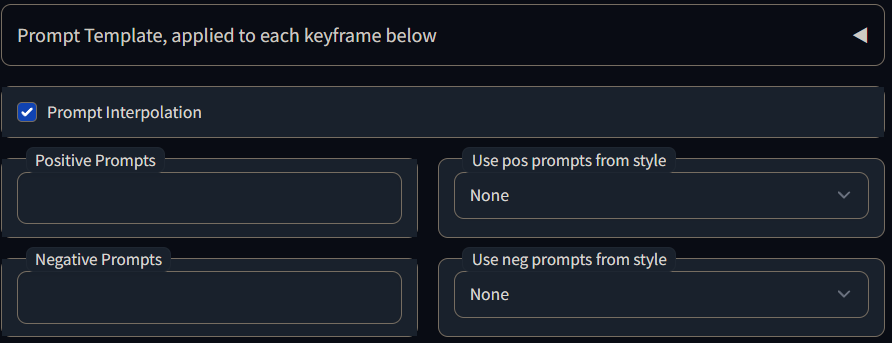

# Animation Script<a name="animationscript"></a>
A basic img2img script that will dump frames and build a video file. Suitable for creating interesting
zoom-in warping movies, but not too much else at this time. The basic idea is to story board some kind 
of animation with changes in prompts, translation etc at a low framerat until you get it roughly right.
Then bump up the framerate for a final render, it should play out roughly the same, just  more detail.

This is intended to be a versatile toolset to help you automate some img2img tasks. It certainly isn't
a one-stop shop for digital movies.

Inspired by Deforum Notebook, which has not turned into an extension. This might be a bit easier to use but is probably not as powerful.
Must have ffmpeg installed in path to create movies, but image sequences will be created regardless. 
This suffers from img2img embossing, if the image is static for too long. I would have to look at 
someone else's implementation to figure out why and don't want to steal their code.

## Table of Contents<a name="toc"></a>
1. [Animation Script](#animationscript)
2. [Major Features](#majorfeatures)
    1. [FILM](#film)
3. [Installation](#installation)
4. [Examples](#example)
   1. [Transform](#example_transform)
   2. [Prompt Interpolation](#example_prompt_interpolation)
   3. [Seed Travel](#example_seed_travel)
5. [Settings](#settings)
    1. [Persistent Settings](#persistent_settings)
    2. [Generation parameters](#generation_parameters)
    3. [Animation Parameters](#animation_parameters)
    4. [Prompt Templates](#prompt_templates)
    5. [Video Formats](#video_formats)
6. [Keyframes](#keyframes)
    1. [clear_stamp](#clear_stamp)
    2. [clear_text](#clear_text)
    3. [denoise](#denoise)
    4. [model](#model)
    5. [prompt](#prompt)
    6. [prompt_from_png](#prompt_from_png)
    7. [prompt_vtt](#prompt_vtt)
    8. [prop](#prop)
    9. [seed](#seed)
    10. [set_stamp](#set_stamp)
    11. [set_text](#set_text)
    12. [source](#source)
    13. [template](#template)
    14. [transform](#transform)
    15. [perspective](#perspective)
7. [Changelog](#changelog)

# Major Features<a name="majorfeatures"></a>
- Transformation
    - In img2img mode, the picture can be zoomed and panned around to create pull shots, pans and the 
      like. Off-frame sections will be filled in with edge pixels.
- Prompt marching
    - Prompts will be walked from one to the next. The Both prompts will be AND together with opposing
      weights.
- Seed marching
    - In txt2img mode, a seed value can be walked to another using subseed strength. It won't be a 
      seamless transition. Parts of the image will change independently in sequence.
- Text boxes, props
    - Post-processing effects can be added onto frames that are written to disk. Maybe used for 
      creating interesting videos.

# Installation<a name="installation"></a>
To create videos, you need FFMPEG installed and available in your path. i.e. open a command line and type in ffmpeg.exe,
you should be able to run the program.<br>

This extension can be installed from the extension tab in webUI. Enter the GitHub link in the 
installation tab on the extensions tab.

`https://github.com/Animator-Anon/animator_extension`

Or use this command:

`git clone https://github.com/Animator-Anon/animator_extension extensions/animator_extension`

### FILM<a name="film"></a>
FILM needs to be installed separately, it is not bundled with this extension. Head to 
https://github.com/google-research/frame-interpolation to get it done. Once you have it installed, create a .bat file 
that takes two arguments and can run the script from any location. The first argument is the source picture location, 
which this script will set automatically, and the second is the number of iterations, or sub frames to add.
In my case, I installed FILM in a python VENV, different to the one the webUI is running in, so I have to change to it:<br>
```
call %USERPROFILE%\miniconda3\condabin\conda.bat activate ldm
python -m eval.interpolator_cli --pattern "%1" --model_path pretrained_models\film_net\Style\saved_model --times_to_interpolate %2
call %USERPROFILE%\miniconda3\condabin\conda.bat deactivate
```
[Bsck to top](#toc)

# Examples:<a name="example"></a>
There seems to be confusion on how to use the keyframes. Copy them into the keyframe box and change the values to suit.
Here are some examples:

## Transform:<a name="example_transform"></a>
    0   | template  | countryside, vineyard, grapevines, bunches of grapes, nice pencil drawing, masterpiece | low quality
    0   | seed      | 1
    0   | transform | 2   |    0 |    0 |   0
    2   | transform | 1   |  200 |    0 |  90
    4   | transform | 1   |    0 |  200 |   0
    6   | transform | 1   | -200 |    0 | -90
    8   | transform | 1   |    0 | -200 |   0
    10  | transform | 0.5 |    0 |    0 |   0

https://user-images.githubusercontent.com/114563845/219329470-eff355a7-b24b-4072-bdac-bc86aa9bcf7c.mp4

A template is set at the start, which would be the same as setting a prompt in this case as there are no changes.
An initial seed value is set, to make the result reproducible.I would consider 200 pixels per second and 90 degrees per 
second rotation at this framerate to be too much, as it crates artifacts on the side which mostly get turned into 
pencils due to the prompts.You will also notice the interpolation of the translation parameters creates a smooth motion.
Technically there is not a full 2 seconds of zoom in at the start, it starts at 2 and works it's way down to zero.

## Prompts:<a name="example_prompts"></a>
    0 | template | masterpiece, high quality | cropped, watermark, text, poor quality
    0 | prompt | barn, haybales, cats | dogs
    5 | prompt | field, cows, fence | aliens
    10 | prompt | combine harvester, wheat field | organic crops

(movie placeholder)

What's the difference between templates, prompts and styles?
- A style is a pre-defined set of prompts you can save in the UI and apply at any time. The one you pick from the drop down will be treated like a template and be applied to every frame.
- A template is a set of prompts that will be applied to all frames.
- A prompt when set, will be applied until they are changed again. The templates and styles will be added.

Other types of prompts:

    time_s | prompt | positive_prompts | negative_prompts
    time_s | template | positive_prompts | negative_prompts
    time_s | prompt_from_png | file_path
    time_s | prompt_vtt | vtt_filepath

## Prompt Interpolation:<a name="example_prompt_interpolation"></a>
    0 | template | masterpiece | poor quality
    0 | seed | 1
    0 | prompt | countryside, sunny day, lush green fields, cattle | 
    10 | prompt | hell scape, desolation, post apocolyptic, demons |
    10 | seed | 1

This seems somewhat broken at the moment, it can create erratic results that jump back and forth.
What I have done there is fix the seed over the entire 10s run, disable loopback mode (in the UI), and have it generate 
100 frames from the start prompt to the end prompt.

## Seed Travel:<a name="example_seed_travel"></a>
    0 | prompt | road, transformer, optimus prime, masterpiece | poor quality
    0 | seed | 2763606728
    4 | seed | 2763606725

https://user-images.githubusercontent.com/114563845/219329858-37609fdc-5998-43fe-86c6-fdf27f13c911.mp4

Turn on seed travel, turn off loopback, set a non-ancestral sampler, and you are good to go. Ancestral samplers such as 
Euler_a don't work well with seed travelling.

## Sources:<a name="example_sources"></a>
    0 | prompt | road, transformer, optimus prime, masterpiece | poor quality
    0 | seed | 2763606728
    4 | seed | 2763606725

(movie placeholder)

You can specify a different source for images in the process loop. Only one source can/will be set. You can pick either a movie or a series of images, and they will be used in alphabetical order.
This only makes sense in loopback mode, so you can get img2img to work on a video file 

[Bsck to top](#toc)

# Settings:<a name="settings"></a>
Many explanations exist in the up in expandable sections of the page. Look for a triangle right side.

## Generation Parameters<a name="generation_parameters"></a>


Most parameters here self-explanatory and the same as they would be for other tabs.

### Denoising Strength:<a name="denoising_strength"></a>
Initial denoising strength value, overrides the value above which is a bit strong for a default. Will be overridden by
keyframes when they are hit.
Note that denoising is not scaled by fps, like other parameters are.

### Seed travel:<a name="seed_travel"></a>
Utilise the sub-seeds to travel between two different, and unrelated by design, seeds. If you have set two different 
seeds using the keyframes below, all intermediate frames will have:
- Seed value will be the first seed value,
- Sub-Seed value will by the end seed value,
- The sub-seed strength will be a value from 0.0 to 1.0.
This can be handy if you keep a set series of prompts but with different seeds and to try and create an animation from 
- one to the other.

## Animation Parameters<a name="animation_parameters"></a>


### Total Animation Length (s):<a name="total_animation_length"></a>
Total number of seconds to create, can be a floating point number. Will calculate the number of frames as time * FPS.
The idea here is you can plan out a flow FPS version of an animation, and then up the framerate for a more detailed 
render. That is the theory anyway, it is more complex than that.

### Framerate:<a name="framerate"></a>
Frames per second to generate. Smoothing frames below will insert additional frames and change the resulting FPS, but 
the length should remain the same. You can change the FPS value in the resulting bat files in the output folder and run 
it to re-create the video.

### Smoothing Frames:<a name="smoothing_frames"></a>
Insert additional frames between every rendered frame. They will be a basic faded merge between the surrounding rendered
frames, so are quick to generate and an easy way to bump up the frame rate.


### FILM Interpolation:<a name="film_interpolation"></a>
Call out the FILM interpolation to insert additional frames between rendered keyframes. FILM must be installed 
separately and a bat file created, see above. The method FILM uses to insert additional frames is different to my method. The Smoothing Frame count is a number of passes FILM does over the image series, each time inserting new frames. The resuling FPS will be:


Or look at the settings.csv file created int he output folder, it will contain a final_fps value.

## Prompt Templates<a name="prompt_templates"></a>


### Prompt Interpolation:
This is another feature of some diffusers, where it can generate an image part-way between two sets of prompts using the 
(prompt1:0.5) AND (prompt2:0.5) format. This can be automated here and the script can automatically render each frame 
using an intermediate prompt between the previous and next prompts. This makes more sense to NOT use it in the loopback
mode, since it can generate unique images without relying on previous ones.

### Templates:<a name="templates"></a>
Provide common positive and negative prompts for each keyframe below, save typing them out over and over. They will only
be applied when a keyframe is hit. The prompts in the keyframes will be appended to these and sent for processing until
the next keyframe that has a prompt.

[Bsck to top](#toc)

# Keyframes:<a name="keyframes"></a>
Key frames have been broken down into individual commands, since the old keyframe was blowing out.
Lines starting with a # are ignored, can be used as comments, or to disable a keyframe.
Commands:

### source<a name="source"></a>
Set source of frames for processing.

- Format: `time_s | source | video, images, img2img | path`
- time_s: Time in seconds from the start to make the change.
- prompt: video, images, img2img. Source for the video frames. Default img2img.
- path: Either the file name of the video file, or the path and wildcard filename of the images.

### prompt<a name="prompt"></a>
Set positive and negative prompts.

- Format: `time_s | prompt | positive_prompts | negative_prompts`
- time_s: Time in seconds from the start to make the change.
- prompt: Command name.
- positive_prompts: Replacement positive prompts. Will be concatenated with the positive template.
- negative_prompts: Replacement negative prompts. Will be concatenated with the negative template.

### template<a name="template"></a>
Set positive and negative prompt template. Purely saves filling out the boxes above in the web UI.

- Format: `time_s | prompt | positive_prompts | negative_prompts`
- time_s: Time in seconds from the start to make the change.
- template: Command name.
- positive_prompts: Replacement positive prompts. Will be concatenated with the positive template.
- negative_prompts: Replacement negative prompts. Will be concatenated with the negative template.

### prompt_from_png<a name="prompt_from_png"></a>
Sets the seed, positive and negative prompts from the specified png file, if it contains it.

- Format: `time_s | prompt_from_png | file_path`
- time_s: Time in seconds from the start to make the change.
- prompt_from_png: Command name.
- file path and name to a png file that contains the info you want.

### prompt_vtt<a name="prompt_vtt"></a>
Loads a series of prompts from a .vtt subtitle file. The first cue is read as positive prompts | negative prompts, and
set at the specified cue time.

- Format: `time_s | prompt_vtt | vtt_filepath`
- time_s: Time in seconds from the start to make the change.
- prompt_vtt: Command name.
- file path and name to a vtt file that contains the positive and negative prompts.

### transform<a name="transform"></a>
Set the current transform.

- Format: `time_s | transform | zoom | x_shift | y_shift | rotation`
- time_s: Time in seconds from the start to make the change.
- transform: Command name.
- zoom: New zoom value. This is a scale used to resize the image. 2 = scale image to 200% over 1 second. 0.5 = scale image to 50% over 1 second.
- x_shift: X shift value, in pixels per second.
- y_shift: Y shift value, in pixels per second.
- rotation: Rotation, in degrees per second.

### perspective<a name="perspective"></a>
Do a distortion/skew/perspective transform on the image. The shape defined below will be stretched to the current
 pictures dimensions, and a sharpening filter will be applied.

- Format: `time_s | perspective | x0 | y0 | x1 | y1 | x2 | y2 | x3 | y3 | unsharpen_percentage<br>`
- time_s: Time in seconds from the start to make the change.
- perspective: Command name.
- x0, y0: Upper left corner 
- x1, y1: Upper right corner 
- x2, y2: Lower right corner 
- x3, y3: Lower left corner 
- unsharpen_percentage: Sharpen filter strength after the transform. 100 = 100%, no change. Try 120.

### seed<a name="seed"></a>
Force a specific seed. It's technically a thing you can do, how usefull it is, is up to you to decide.

- Format: `time_s | seed | new_seed_int`
- time_s: Time in seconds from the start to make the change.
- seed: Command name.
- new_seed_int: New seed value, integer. I don't think string seeds will work.

### denoise<a name="denoise"></a>
Set the denoise strength.

- Format: `time_s | denoise | denoise_value`
- time_s: Time in seconds from the start to make the change.
- denoise: Command name.
- denoise_value: New denoise strength value.

### set_text<a name="set_text"></a>
Overlay a rounded text box in post-processing. I.e. only applied to the image that is saved, and it is not iterated on.
The text will be centered in the box with the largest font size that will fit.
Text boxes are referenced by the name you give. If you set it again, you can change the contents. Or it can be cleared.
Multiple text boxes with different names can exist at the same time.

- Format:`time_s | set_text | textblock_name | text_prompt | x | y | w | h | fore_color | back_color | font_name`
- time_s: Time in seconds from the start to make the change.
- set_text: Command name.
- textblock_name: Unique name or tag given to this text block in the set_text command above.
- text_prompt: Text to put in the text block. You can use \n for multi-line.
- x: Top left X position of the text block.
- y: Top left Y position of the text block.
- w: Width of text block
- h: Height of text block
- fore_color: colour name as string, or a tuple of bytes (127,0,127)
- back_color: colour name as string, or a tuple of bytes (127,0,127)
- font_name: name of the font file. Python will attempt to scan your system font folders for this file.

### clear_text<a name="clear_text"></a>
Remove a named text box, it will no longer be drawn on the saved images.

- Format: `time_s | clear_text | textblock_name`
- time_s: Time in seconds from the start to make the change.
- clear_text: Command name.
- textblock_name: Unique name or tag given to this text block in the set_text command above.

### prop<a name="prop"></a>
Embed a clipart image into the picture to be diffused. it will be drawn once at this time. You need to set a prop folder
where transparent pngs are held, and specify them by file name.

- Format: `time_s | prop | prop_filename | x_pos | y_pos | scale | rotation`
- time_s: Time in seconds from the start to make the change.
- prop: Command name.
- prop_filename: Name of a picture in the props folder, hopefully with transparency.
- x_pos: Center position of the prop.
- y_pos: Center position of the prop.
- scale: Scale value. 1=100% etc.
- rotation: Rotation, in degrees.

### set_stamp<a name="set_stamp"></a>
Like props but applied in post processing and will not be diffused. You ca reference them by name, change their details
on the fly as with text boxes.

- Format: `time_s | set_stamp | stamp_name | stamp_filename | x_pos | y_pos | scale | rotation`
- time_s: Time in seconds from the start to make the change.
- set_stamp: Command name.
- stamp_name: Unique name or tag given to this stamp. Used to change it's parameters or delete.
- stamp_filename: Name of a picture in the props folder, hopefully with transparency.
- x_pos: Center position of the stamp.
- y_pos: Center position of the stamp.
- scale: Scale value. 1=100% etc.
- rotation: Rotation, in degrees.

### clear_stamp<a name="clear_stamp"></a>
Clear out a stamp, will no longer be drawn on the saved images.

- Format: `time_s | clear_stamp | stamp_name`
- time_s: Time in seconds from the start to make the change.
- clear_stamp: Command name.
- stamp_name: Unique name or tag given to this stamp in the set_stamp command above.

### model<a name="model"></a>
Allows you to change the model on the fly, if you need to. It won't change it back at the end, so if you do use this,
maybe set the initial model in frame 0 first.

- Format: `time_s | model | model_name`
- time_s: Time in seconds from the start to make the change.
- model: Command name.
- model_name: Pick one from the list. Just the name with no extension or hash is fine.

[Bsck to top](#toc)

## Persistent Settings:<a name="persistent_settings"></a>
There are some persistent settings that are on the WebUI settings page. These will be stored by WebUI.
- FILM batch or script file, including full path
    - Full path to a batch file that can be called for FILM interpolation.
- Prop folder
    - The folder that prop pictures will be read from.
- New output folder
    - Output folder specifically used by this extension. Saves loading up the general output folders. 

## Video formats:<a name="video_formats"></a>
Create GIF, webM or MP4 file from the series of images. Regardless, .bat files will be created with the right options to
make the videos at a later time.

[Bsck to top](#toc)

# Changelog<a name="changelog"></a>
- Extension
    - Re-fectored script into an extension, easier to manage and work with.
- v6
    - Allowed the script to work in txt2img tab. This is mainly for seed marching, as it doesn't make sense to recycle
      the images in this mode.
    - Each frame is a fresh generation between two seeds.
    - Re-enabled transforms for video and image sources. Requested feature.
    - Added some new prompt commands.
- v5
    - Added some different sources for frames. If video is specified, frames will be grabbed from the supplied video
      file, until the end of the video is hit. Then the last frame will be repeated (i think). Images works silimarly,
      but you need to specify a path and wilcard file name, such as c:/images/*.png. A list of images will be created,
      alphabetically sorted by default. If there are not enough images for the specified duration, the last frame will
      be repeated.
    - Specifying a different source other than img2img means the initial image in the UI will be ignored, but it needs
      to be there for the UI to work.
    - Further, transformation won't have an effect, as there is no longer a feedback loop.
- v4
    - Investigating seed marching. Look at some scripts and figured out how subseeds are meant to be used. Implemented
      it as an option. If you add seed keyframes and check the seed march box, the script will migrate from one seed to
      the next using the subseed & subseed strength interpolation. if you leave seed march unckecked, the seed value
      will interpolate from one integer to the next. View the final values in the dataframe .csv dump in the output
      folder.
    - Seed marching doesn't seem to work well with transforms, if you combine them you'll get poor results.
- v3
    - Changed the interpolation system, so various keyframes write values into a frame dataframe. Blank values are then
      interpolated, so transform changes are smoother. also used to interpolated prompts by default now.
- v2
    - Broken down the growing prompt into individual commands to control various parameters. Added requested features.
      Rolled in changed from pull requests, thanks to contributers.
- Original
    - Original version of the script with one basic prompt format.
